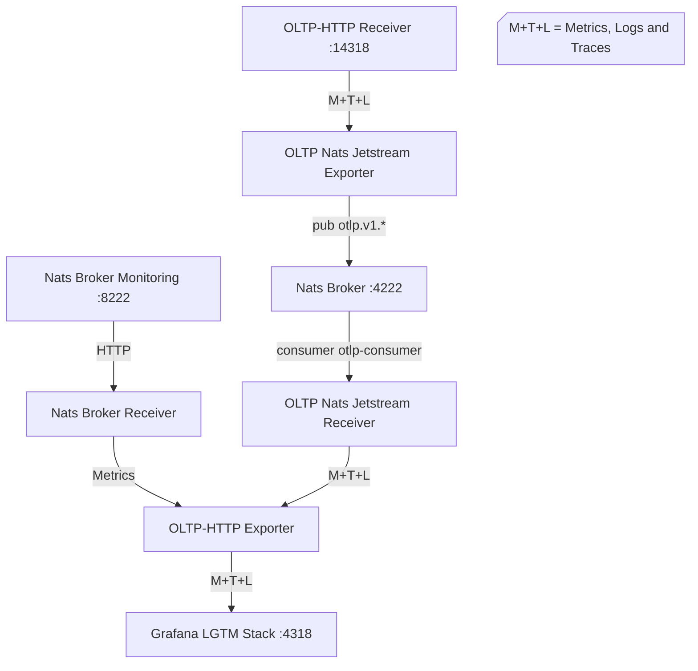

# Demo
This demo requires [mise](https://mise.jdx.dev/getting-started.html) to be installed and configured

1. `mise trust . -r`
2. `mise install`
3. `mise r serve ::: build`
4. In separate terminal: `mise r gen-telemetry`
5. Navigate in browser to http://127.0.0.1:3000 and browse generated telemetry

The demo shows two data paths:

- traces and logs flow through `otlp_nats_jetstream`
- NATS broker metrics are scraped by `nats_broker` and sent directly to LGTM over OTLP HTTP

Note: Grafana in LGTM seems to display metrics with 1m resolution, despite Nats Broker Receiver sending them every 10s.